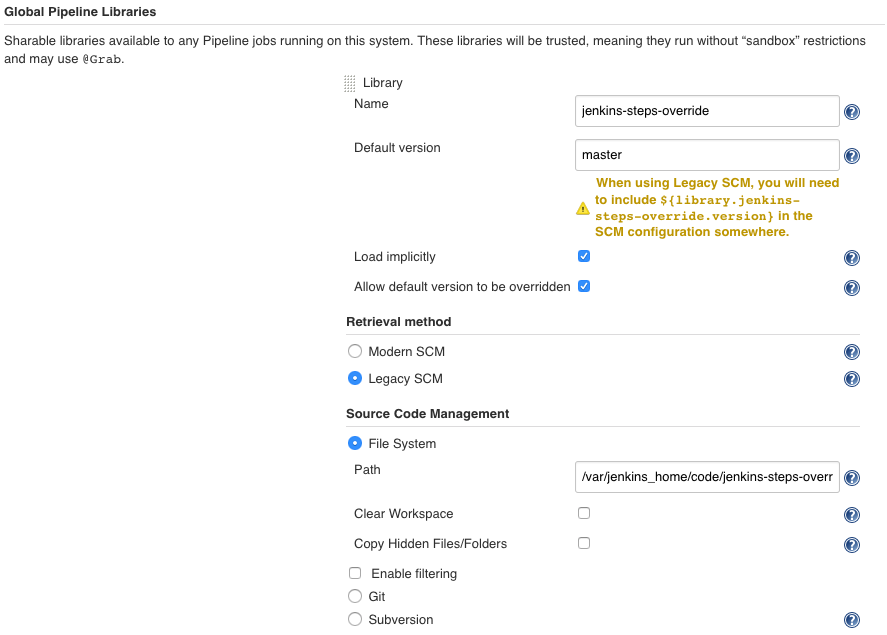

# jenkins-steps-override
Override Jenkins Pipeline steps for local development

### Context

This repo is just one part of [a larger project](https://github.com/tdongsi/jenkins-config) for local development of Jenkins Pipeline libraries.
Basic Pipeline steps such as `mail` or `sendSlack` that requires complex setup or communication to external systems can be mocked in this library.
 
### Configure local Jenkins

The idea is that since Jenkins Global Libraries allow me to create my own global variables, I can configure a Library which overrides some built-in steps.
To make my custom global variables/overridden steps active over built-in steps, configure a "Global Pipeline Library" in  "Manage Jenkins > Configure System" as follows:

